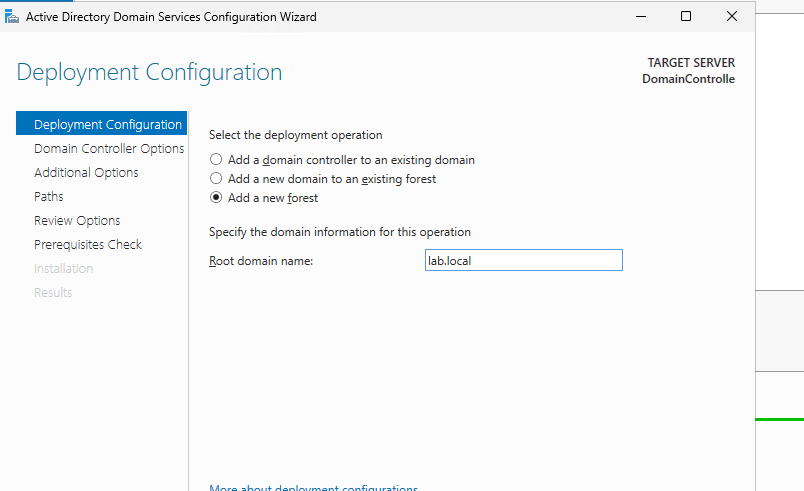
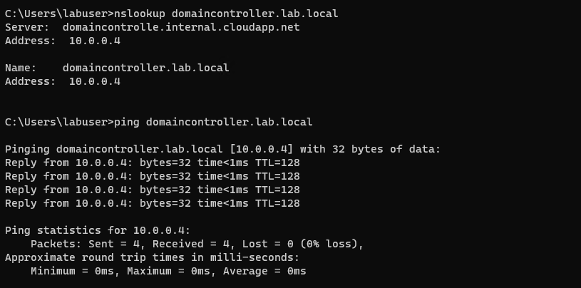
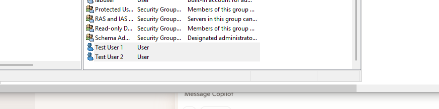
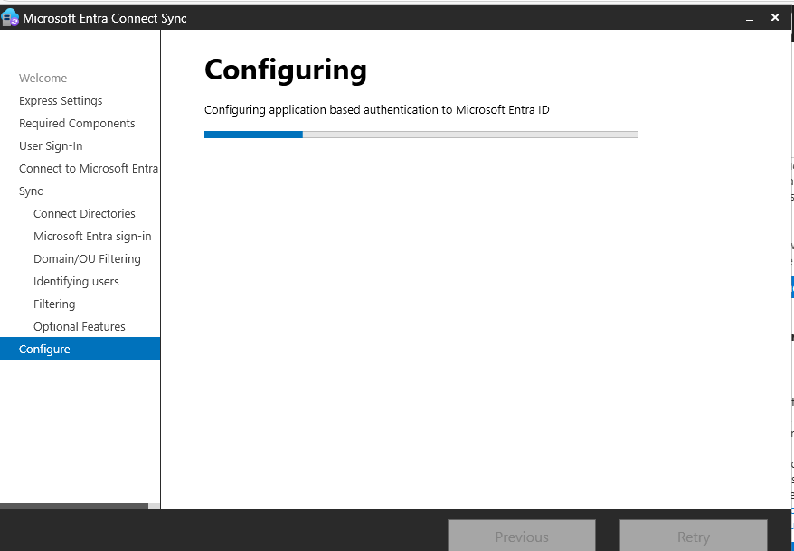
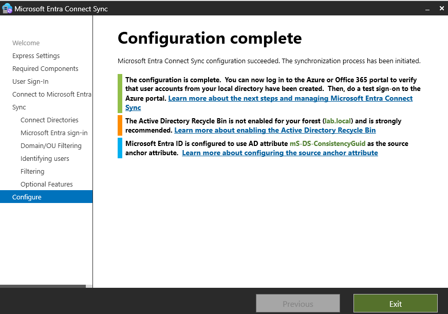
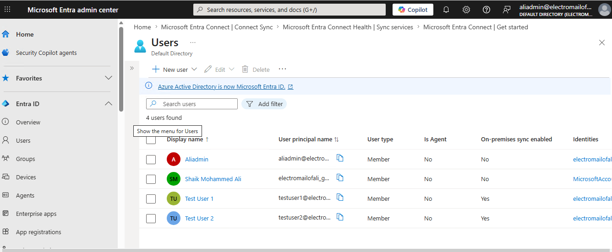

# Lab 9: Hybrid Identity – ADDS + Azure AD Connect

## 🎯 Objective
Deploy and configure Active Directory Domain Services (ADDS) and Azure AD Connect to synchronize on‑premises Active Directory users with Azure Entra ID, enabling hybrid identity management.

---

## ⚙️ Resources Deployed
| Resource Type | Name / Configuration |
|---|---|
| Resource Group | rg-adconnect-lab |
| Virtual Network | vnet-adconnect-lab |
| Domain Controller VM | dc-lab (Windows Server 2022) |
| Member Server VM | adconnect-lab (Windows Server 2022) |
| Active Directory Forest | lab.local |
| DNS Configuration | Internal DNS resolution via Domain Controller |
| Identity Synchronization | Microsoft Entra Connect Sync |
| Cloud Identity Platform | Microsoft Entra ID |

## 📦 Deployment Scope
This lab focused on building a hybrid identity environment by integrating on-premises Active Directory Domain Services (ADDS) with Microsoft Entra ID using Azure AD Connect.
 
The deployment included:
- Windows Server 2022 Domain Controller configuration
- ADDS forest creation for `lab.local`
- DNS configuration and internal name resolution
- Domain join operations for member server integration
- Test user creation and authentication validation
- Azure AD Connect installation and synchronization setup
- Verification of successful identity synchronization into Microsoft Entra ID

---

## 🛠️ Deployment Workflow & Troubleshooing

### 1️⃣ Active Directory Domain Services Installation  
Installed the Active Directory Domain Services (ADDS) role on Domain Controller VM using Server Manager.  

---

### 2️⃣ Domain Controller Configuration & Forest Creation
Promoted `dc-lab` to Domain Controller and configured a new Active Directory forest for `lab.local`.  
  

---

### 3️⃣ DNS Configuration & Resolution  
Configured the member server to use the Domain Controller as its primary DNS server and verified internal name resolution using `nslookup` and `ping`.
  

---

### 4️⃣ Domain Join  Validation
Successfully joined the `adconnect-lab` member server to the `lab.local` Active Directory domain.

---

### 5️⃣ Active Directory User Creation & Authentication Testing
Created test domain user accounts in Active Directory Users and Computers (ADUS) and verified successful authentication using domain credentials.
  

---

### 6️⃣ Microsoft Entra Connect Installation  
Installed Microsoft Entra Connect Sync on the `adconnect-lab` server for hybrid identity synchronization.
  

---

### 7️⃣ Microsoft Entra Connect Synchronization Configuration
Configured synchroniaztion between on-premises Active Directory and Microsoft Entra ID using Microsoft Entra Connect Sync.

---

### 8️⃣ Synchronization Validation & User Verification 
Validated synchronization scheduler health and confirmed successful synchronization of on-premises users into Microsoft Entra ID.
  

Verified synchronized on-premises Active Directory users successfully appeared in Microsoft Entra ID.

## 📊 Operational Validation
- Successfully deployed and promoted Windows Server 2022 as Domain Controller.
- Configured `lab.local` Active Directory forest with internal DNS resolution.
- Verified successful communication between domain-joined systems.
- Created and authenticated test domain users through ADUC.
- Installed and configured Microsoft Entra Connect synchronization services.
- Validated synchronization scheduler health and sync cycle configuration.
- Confirmed synchronized on-premises identities appeared successfully in Microsoft Entra ID.

## 📚 Key Learnings
- Understood hybrid identity architecture using ADDS and Microsoft Entra ID.
- Configured Domain Controller services, DNS resolution, and domain join operations.
- Learned identity synchronization workflow using Microsoft Entra Connect.
- Validated authentication and synchronization for on-premises Active Directory users.
- Gained practical exposure to enterprise hybrid identity management concepts.

## 💼 Resume Alignment
- Configured hybrid identity infrastructure integrating on-premises ADDS with Microsoft Entra ID.
- Managed Domain Controller deployment, DNS configuration, and domain join validation.
- Implemented Microsoft Entra Connect synchronization for hybrid user identity management.
- Verified synchronization scheduler health and successful identity replication into Entra ID.
- Demonstrated practical understanding of enterprise identity and access management workflows.
 
