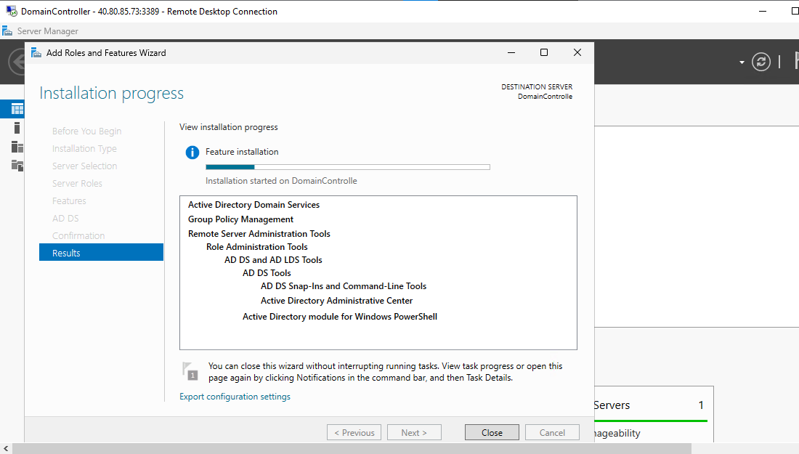
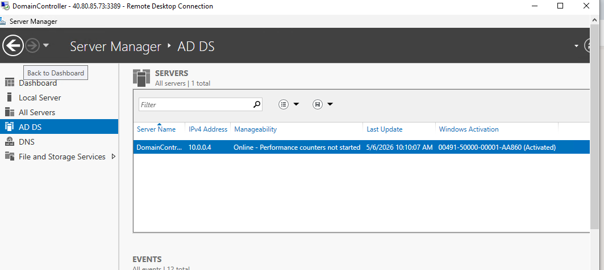
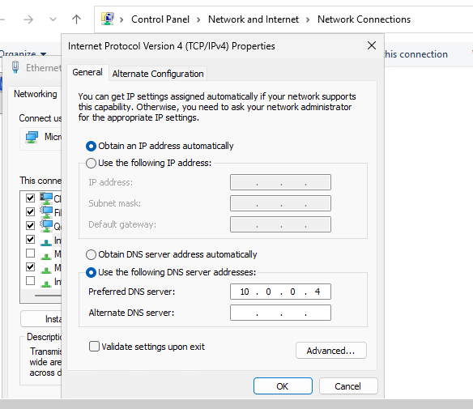
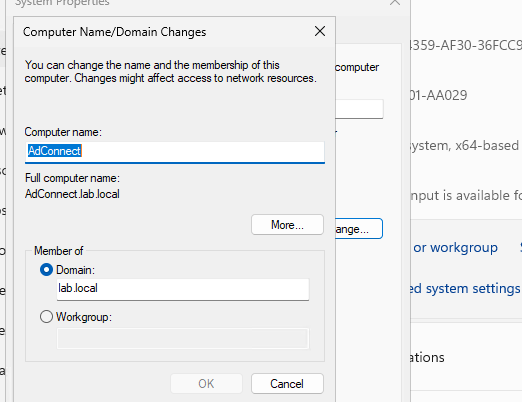
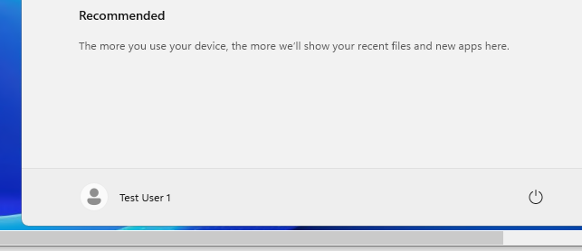
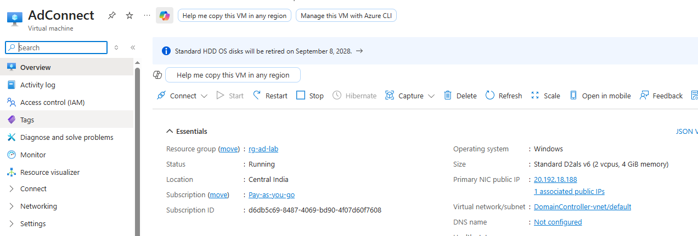
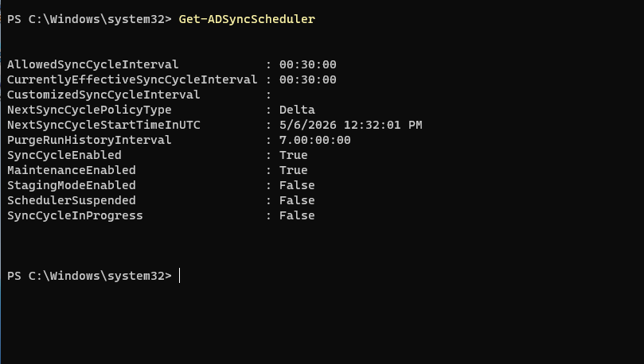

# Lab 9: Hybrid Identity – ADDS + Azure AD Connect

## 🎯 Objective
Deploy and configure Active Directory Domain Services (ADDS) and Azure AD Connect to synchronize on‑premises Active Directory users with Azure Entra ID, enabling hybrid identity management.

---

## ⚙️ Resources Deployed
- **Resource Group**: rg-adconnect-lab  
- **Virtual Network**: vnet-adconnect-lab  
- **Domain Controller VM**: dc-lab (Windows Server 2022)  
- **Member Server VM**: adconnect-lab (Windows Server 2022)  
- **Azure Entra ID tenant**: existing  

---

## 🛠️ Deployment Flow & Screenshots

### 1️⃣ ADDS Installation  
Installed Active Directory Domain Services role on DomainController VM.  

---

### 2️⃣ Domain Controller Promotion  
Promoted `dc-lab` to domain controller and created `lab.local` forest.  
  

---

### 3️⃣ DNS Configuration & Resolution  
Configured DNS on AdConnect VM to point to DomainController.  
Verified name resolution and connectivity.  
  

---

### 4️⃣ Domain Join  
Joined `adconnect-lab` VM to `lab.local` domain.  

---

### 5️⃣ Test Users Creation & Login  
Created `Test User 1` and `Test User 2` in ADUC.  
Verified login with domain account `testuser1`.  
  

---

### 6️⃣ Azure AD Connect Installation  
Installed Azure AD Connect on `adconnect-lab`.  
  

---

### 7️⃣ AD Connect Configuration Wizard  
Configured synchronization between on‑prem AD and Entra ID.  

---

### 8️⃣ Synchronization Status  
Verified sync scheduler and successful user sync.  
  

---

## 📚 Key Learnings & Resume Highlights
- Promoted Windows Server VM to **Domain Controller** and configured ADDS  
- Created and managed **on‑premises Active Directory users**  
- Installed and configured **Azure AD Connect** for hybrid identity  
- Verified synchronization of users into **Azure Entra ID**  
- Demonstrated **hybrid identity integration** aligned with enterprise environments  

